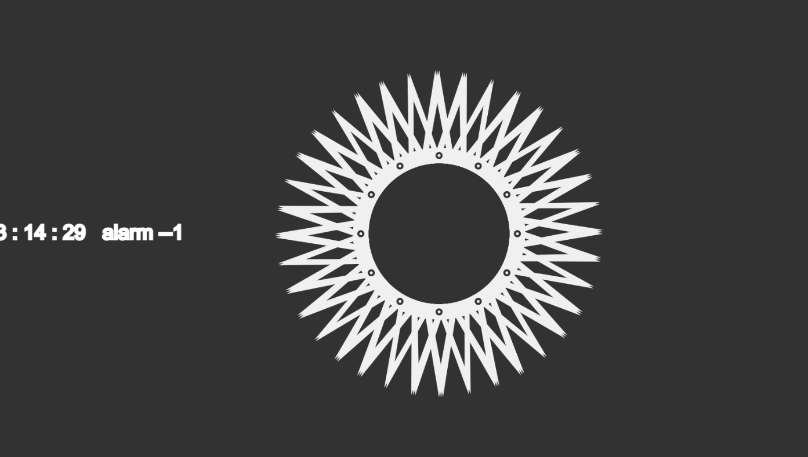
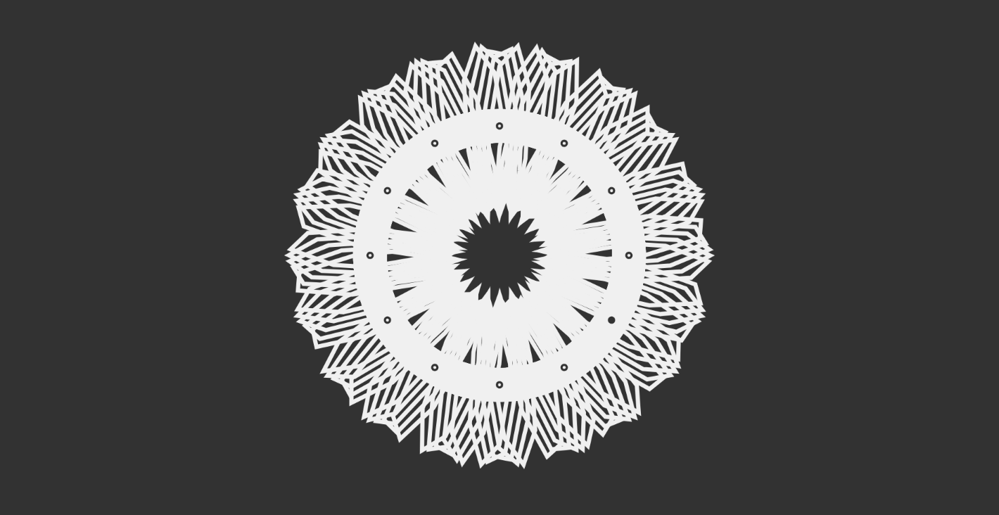

## MDDN 242 Project 1: Time-based Media  

## How the clock works
The clock represents hours by the number of shapes and elements. Minutes are represented by the filled circle around the face of the clock. It also will align itself every minute. It will transition hours seamlessly however this can take up to 1 minute I realised that for marking this isn’t practical so I have disabled it by default however if you want to enable it you can do so by change line 2 and 3 in clock.js to
let init = false;
var waitForHourChange = false;
Please be aware that for every hour the clock and alarm look completely different so please test using a few different times. My favourites are 11 and 12 O’clock, to easily read the time you might need to wait a minute for the shapes to align especially for later hours where there is alot going on. 

## Week 1
My idea for my clock sketch was to represent the hour hand as a segment that is uncovered and the minute hand is shown on the outside of the clock. In this example the time is 8:10 

## Week 2
This is my clock so far I have been playing around with mapping sin and cos functions to create cool effects. I plan on making my alarm do something with z axis rotation and colours

## Week 3
I have been working on my alarm, I have found it difficult to make both my main clock and my alarm look good because I find that each time I improve one the other one gets worse. I have now got my alarm to a point where I am pretty happy with however I still need to work on my actually clock and work out how I will make it display the time. For seconds I will have it pulse and for hours I will use the circles around the house but I still need to find a way to represent minutes and display which circle is currently active. 

## Week 4
In week 4 my focus was on making my clock function better as a clock. I first did this by making the number of elements represent the hours. This worked well however it created a new much more difficult problem to deal with. Since I used the number of elements or the hours to calculate the radius of the shapes, changing the hour meant there would be a slight change in the size of the object. It also meant there would be a sudden jump in the shape itself so I had to find a way to smoothly transition between hours. I did this by reducing the size of the clock to make the slight jump in size less noticeable and by increasing the thickness of the frame any change of the shape is hidden. 
